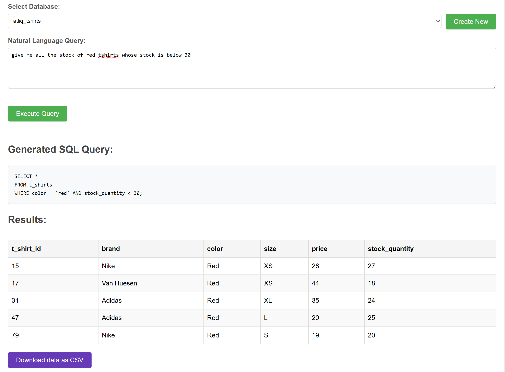
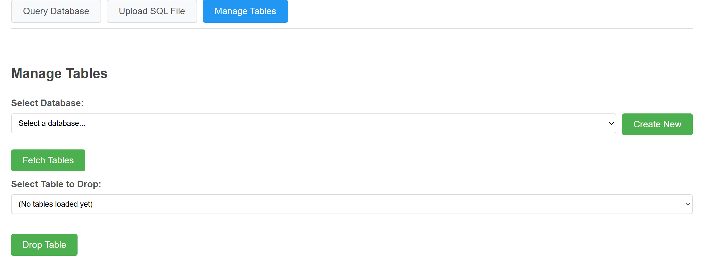

# Natural Language to SQL

)



## 🧠 Overview

This project converts plain English (natural language) queries into SQL using a lightweight NLP pipeline. It allows non-technical users to interact with structured databases without writing any SQL manually.

---

## 🚀 Features

- **Natural Language Parsing** — Converts user queries into tokens and identifies relevant entities.
- **SQL Generation** — Automatically constructs syntactically correct SQL queries from interpreted language.
- **Flexible Deployment** — Run as a CLI tool or via a web server (e.g., Flask).
- **Extensible Architecture** — Can be enhanced with external NLP models or APIs.

---

## 📦 Requirements

- Python 3.8 or higher
- (Optional) Virtual Environment Tool: `venv` or `conda`

---

## ⚙️ Installation

### 1. Clone the Repository

```bash
git clone https://github.com/amitgupta0220/Natural_language_to_SQL.git
cd Natural_language_to_SQL
```

### 2. Create and Activate Virtual Environment (Optional)

```bash
python -m venv venv
# On macOS/Linux
source venv/bin/activate

# On Windows
venv\Scripts\activate
```

### 3. Install Dependencies

```bash
pip install -r requirements.txt
```

---

## ▶️ Usage

### 1. Run the Application

```bash
python app.py
```

Depending on how `app.py` is configured, this will either start:

- a **CLI interface** (prompting user input),
- or a **web server** (e.g., Flask app).

### 2. Interact with the App

- **CLI Mode:**  
  Enter queries like:  
  `"Show me all records from the employees table"`

- **Web Mode:**  
  Open your browser and navigate to:  
  [http://127.0.0.1:5000](http://127.0.0.1:5000)

### 3. View Generated SQL Output

- The input is parsed and transformed into SQL.
- Output is displayed directly in terminal or browser.

---

## 💬 Example Queries

### 🗨️ Natural Language:

> Show me all customers who registered last week.

### 🧾 SQL Generated:

```sql
SELECT * FROM customers
WHERE registration_date >= DATE_SUB(CURRENT_DATE, INTERVAL 7 DAY);
```

---

### 🗨️ Natural Language:

> What’s the total sales for April 2025?

### 🧾 SQL Generated:

```sql
SELECT SUM(amount) AS total_sales
FROM sales
WHERE MONTH(date) = 4 AND YEAR(date) = 2025;
```

> _(Modify these queries to match your actual database schema.)_

---

## 🤝 Contributing

- Fork this repository.
- Create a new branch for your feature or fix.
- Commit and push your changes.
- Submit a pull request.

---

## 📬 Contact

For any questions or suggestions, feel free to open an issue or reach out to the maintainer.
